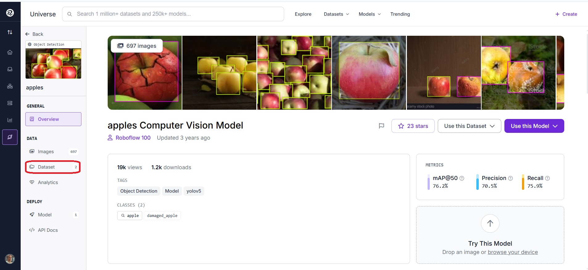

# 🎓 Guia Prático: Treinando seu Próprio Detector com YOLOv8


Neste roteiro, vamos passar por todo o ciclo de vida de um projeto de Inteligência Artificial usando a arquitetura YOLOv8: desde a obtenção e preparação dos dados, passando pelo treinamento (ensinando a IA a enxergar), até a inferência (quando colocamos nossa IA à prova em um vídeo real).

Siga as instruções abaixo com atenção!

---

## 🛠️ Passo 1: A Matéria-Prima (Obtendo o Dataset no Roboflow)

Para treinar uma Inteligência Artificial, precisamos de dados. Vamos usar o **Roboflow**, uma plataforma que hospeda milhares de datasets prontos para uso.

1. **Acesse o Roboflow Universe:** Vá até [https://universe.roboflow.com/](https://universe.roboflow.com/).
2. **Escolha o seu Dataset:** Você pode buscar por algo do seu interesse, como o que usei em meu exemplo: "Aquarium" (para detectar peixes, tubarões, etc.).



3. **Faça o Download no formato correto:**
   - No **menu lateral esquerdo**, procure pela seção **DATA** e clique em **"Dataset"** (onde mostra as versões do dataset).
   - Na página que abrir, você verá o botão **"Download Dataset"** (ou "Export"). Clique nele.
   - Na janela que abrir, é **CRÍTICO** selecionar o formato **YOLOv8**.
   - Escolha a opção de baixar como um arquivo `.zip`.
4. **Organize o seu Projeto:**
   - Pegue o arquivo `.zip` baixado e extraia dentro da pasta do nosso projeto (a pasta `aula-09`).
   - Renomeie a pasta extraída para algo claro, como `dataset_aquarium`.
   - **Importante:** Dentro dessa pasta, verifique se existe um arquivo chamado `data.yaml`. Ele é o "mapa" que diz ao YOLO onde estão as imagens e quais são os objetos que ele deve aprender a reconhecer!

---

## 🎬 Passo 2: O Vídeo de Teste (`aquario.mp4`)

Uma dúvida muito comum é: *"Professor, o vídeo `aquario.mp4` veio junto com o download do Roboflow?"*

**A resposta é NÃO!** O Roboflow nos fornece o **Dataset de Treinamento** (centenas de imagens estáticas e suas anotações). O modelo aprende olhando para fotos.

O arquivo de vídeo (`aquario.mp4`) é o nosso **material de teste**. Ele representa o "mundo real".
1. Vá até o YouTube, Pexels ou qualquer site de vídeos gratuitos e baixe um vídeo curto (em `.mp4`) sobre o tema que você escolheu (por exemplo, um vídeo de um aquário).
2. Salve esse arquivo dentro da subpasta `notebooks` com o nome `aquario.mp4`.
3. É nele que faremos a mágica acontecer lá no final!

---

## 🏋️‍♂️ Passo 3: O Treinamento da IA (Notebooks 09 e 10)

Agora abra o Jupyter Notebook da Aula 10 (`10-prof-saulo-treinamento-yolo.ipynb`). Chegou a hora de treinar a máquina!

1. **O Modelo Base:** Nós não vamos criar um "cérebro" do absoluto zero. Vamos pegar um cérebro que já sabe o básico sobre imagens (o `yolov8n.pt` - a versão Nano, levinha) e fazer um *Transfer Learning* (Transferência de Aprendizado), ensinando a ele a detectar peixes.
2. **Iniciando o Treino:** No notebook, executaremos o comando `model.train()`. Preste atenção aos parâmetros:
   - `data`: Aponta para o seu `data.yaml` que configuramos no Passo 1.
   - `epochs`: Quantas vezes a IA vai estudar todo o dataset (ex: 5 vezes).
   - `imgsz` (416) e `batch` (2): Ajustes para que o treinamento não estoure a memória do seu computador.
3. **Analisando o Desempenho:**
   - Terminando o treino, o YOLO salvará resultados na pasta `runs/detect/train...`.
   - **Abra os gráficos!** Observe o gráfico de **Loss** (que deve cair com o tempo, mostrando que a IA está errando menos) e as métricas como **mAP50** (que devem subir, mostrando que ela está ficando mais precisa).

---

## 🚀 Passo 4: Colocando a IA em Produção / Inferência (Notebook 11)

Sua IA se formou! O cérebro treinado e otimizado dela foi salvo pelo YOLO em um arquivo chamado `best.pt` (dentro da pasta `runs`). Agora vamos usá-lo!

1. Abra o Notebook da Aula 11 (`11-prof-saulo-inferencia-yolo.ipynb`).
2. **Resgatando o Cérebro:** A primeira coisa que o notebook fará é copiar o seu arquivo `best.pt` para a pasta principal, renomeando-o para `modelo_aquario.pt`.
3. **A Prova de Fogo:**
   - O código irá carregar o **SEU** modelo customizado.
   - Em seguida, ele vai processar o vídeo de teste (`aquario.mp4`), frame por frame.
   - Como resultado final, você terá um novo vídeo ou imagens onde a sua Inteligência Artificial desenhou as "bounding boxes" ao redor de peixes e tubarões, identificando cada um com confiança!

Estude os gráficos gerados e aproveite para testar o seu modelo com seus próprios vídeos! Qualquer dúvida, consulte a documentação e os comentários deixados nas células dos notebooks.

---

## 📁 Estrutura Final Esperada do Projeto

Para garantir que você seguiu todos os passos corretamente e está pronto para a etapa final, verifique se a sua pasta `aula-09` possui a seguinte estrutura mínima de arquivos e subpastas:

```text
aula-09/
├── venv/                     <-- Seu ambiente virtual Python
├── dataset_aquarium/         <-- Pasta do dataset baixado do Roboflow
├── notebooks/                <-- Pasta com os scripts da aula
│   ├── 09-prof-saulo-treinamento-customizado-yolo.ipynb
│   ├── 10-prof-saulo-treinamento-yolo.ipynb
│   ├── 11-prof-saulo-inferencia-yolo.ipynb
│   └── runs/                 <-- Criada pelo YOLO (contém gráficos e a pasta detect/)
├── aquario.mp4               <-- Vídeo baixado externamente para os testes
├── modelo_aquario.pt         <-- Seu modelo final treinado (o arquivo best.pt renomeado)
└── yolov8n.pt                <-- Modelo base baixado automaticamente no 1º treino
```
